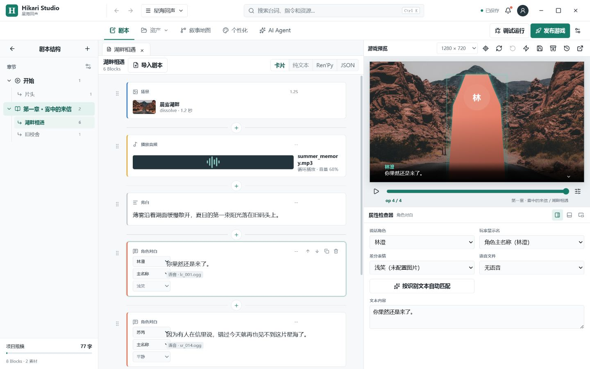
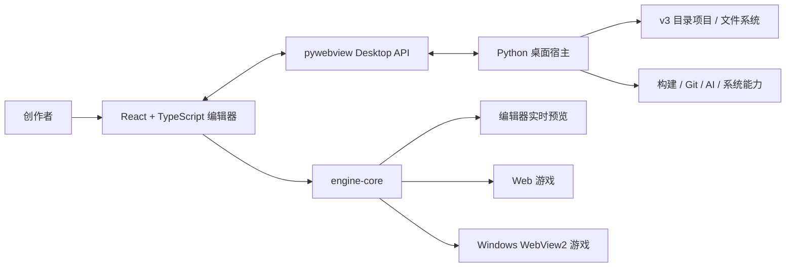
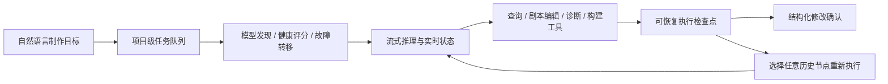

<div align="center">


<a href="https://github.com/kylemarvin884/Hikari-Studio/actions/workflows/ci.yml"></a>


<a href="LICENSE"></a>
<a href="https://github.com/kylemarvin884/Hikari-Studio/releases"></a>

<br /><br />

<a href="https://git.io/typing-svg"></a>

**面向创作者的本地 Galgame 可视化编辑器。** 让剧本、演出、素材、调试与构建留在同一个安静、完整的制作环境中。

[下载预览版](https://github.com/kylemarvin884/Hikari-Studio/releases) · [功能概览](#-功能概览) · [快速开始](#-快速开始) · [技术架构](#-技术架构) · [开发进度](#-开发进度)

</div>

> [!IMPORTANT]
> Hikari Studio 仍处于积极开发阶段，当前仓库是可运行的工程预览版，不代表稳定发行版。项目格式会提供迁移能力，但公开 API 仍可能调整。

## 下载与版本

<p align="center">
  <a href="https://github.com/kylemarvin884/Hikari-Studio/releases"></a>
  <a href="https://github.com/kylemarvin884/Hikari-Studio/releases"></a>
</p>

当前 Release 提供可复现的源码归档，适合开发者试用和参与开发。Windows 编辑器安装包仍在稳定化阶段，正式提供前不会用启动器或不完整构建冒充安装包。

## 编辑器预览

<p align="center">
  
</p>

<div align="center"><sub>剧本 Block 编辑 · 游戏实时预览 · OP 定位 · 属性检查器</sub></div>

## 功能概览

| 工作区 | 当前能力 |
| --- | --- |
| **剧本编辑** | 对白、旁白、场景、声音、角色演出、变量、条件、分支、跳转与 Fragment 调用 |
| **四种视图** | 卡片编辑、纯文本、Ren'Py 风格摘要、底层 JSON OP |
| **角色与场景** | 每个表情独立立绘、多层场景、视差距离、图层偏移、立绘拖拽与吸附辅助线 |
| **资源管线** | 图片、音频、视频、字体管理，引用分析、缺失诊断、强制打包与文件夹批量修复 |
| **叙事地图** | 可移动流程节点、章节与 Fragment 关系、变量因果追踪、分支连线 |
| **实时调试** | 编辑器与 OP 双向定位、变量观察、调用栈、Console、快速存档与流程回滚 |
| **游戏运行时** | 打字机文本、自动播放、快进、历史、存读档、音量与文本速度设置 |
| **主题系统** | 对白字体、颜色、渐变高度、姓名样式、系统菜单和存档界面实时预览 |
| **构建发布** | Web 游戏、Windows WebView2 启动器与 Ren'Py 导出 |
| **AI Agent** | 模型自动发现与健康评分、自动故障转移、流式任务队列、网络级取消、暂停恢复和历史检查点重跑 |

<details>
<summary><strong>展开查看素材健康与自动修复规则</strong></summary>

- 统一检查角色立绘、角色覆盖层、场景图层与游戏 UI 图片。
- 按 SHA-256、完整文件名、扩展名和文件大小递归匹配迁移后的素材目录。
- 冲突候选不会静默写入；所有批量替换先预览，再由用户确认。
- 替换保留稳定素材 ID，因此角色、场景、剧本和 UI 引用会同步刷新。

</details>

## 技术架构



编辑器预览、Web 游戏和 Windows 游戏共享同一套 TypeScript `engine-core`，避免三套运行逻辑逐渐产生行为差异。

## AI 制作 Agent

Hikari Agent 不是单独的聊天窗口，而是可以读取项目上下文、调用受控工具并持续执行制作任务的工作流。用户只需配置兼容接口 URL 与 API Key；密钥由桌面宿主保存，不进入项目文件。



- 从上游 `/models` 自动发现模型，按能力、健康度与可用性推荐，并支持手动模型 ID 兜底。
- 健康结果使用 TTL 缓存、后台重测和熔断恢复，调用失败时自动切换到可用模型。
- 长任务提供流式文本、步骤状态、暂停、继续和 Provider 级请求中止。
- 会话与检查点保存在项目 `.hikari/agent/sessions`，可以在可视化时间线中选择任意历史节点派生重跑。
- 历史重跑创建独立派生任务，原始任务、事件和结果保持不变；检查点内部执行状态不会暴露到前端。

| 目录 | 职责 |
| --- | --- |
| `backend/` | Python 桌面宿主、项目存储、桌面 API、导入与构建能力 |
| `frontend/src/` | React + TypeScript 编辑器界面 |
| `frontend/src/engine-core/` | Block 注册、运行状态、诊断和共享执行逻辑 |
| `frontend/src/runtime/` | 导出游戏使用的玩家运行时 |
| `launcher/Hikari.GameLauncher/` | 基于 .NET 8 WebView2 的 Windows 游戏启动器 |
| `data/star-sea-echo/` | v3 格式示例项目 |
| `tests/` | Python 项目存储、API、导入、导出和构建测试 |

## 快速开始

### 环境要求

- Windows 10/11
- Python 3.12+
- Node.js 22+ 与 pnpm 10+
- .NET 8 SDK，仅在构建 Windows 游戏时需要

### 运行桌面编辑器

```powershell
git clone https://github.com/kylemarvin884/Hikari-Studio.git
cd Hikari-Studio

python -m pip install -r requirements.txt
cd frontend
pnpm install --frozen-lockfile
pnpm build
cd ..

python run.py
```

Windows 用户也可以在依赖安装完成后运行 `start.bat`。

桌面版默认使用 Windows 标准目录：

- 项目：`文档/Hikari Studio/Projects`
- 构建：`文档/Hikari Studio/Builds`
- 配置、日志与缓存：`%LOCALAPPDATA%/Hikari Studio`

首次启动会复制旧版仓库 `data/` 中的项目，源文件不会被删除。传入 `--portable` 可改用程序目录旁的 `projects` 与 `user-data`。

### 构建独立 Windows 编辑器

```powershell
powershell -ExecutionPolicy Bypass -File scripts/build-editor.ps1
```

编辑器使用 Nuitka 编译为 Windows 本机 standalone 程序，产物位于 `dist/HikariStudio/HikariStudio.exe`，运行时不需要用户安装 Python、Node.js 或 pnpm。Windows 游戏构建所需的 WebView2 启动器也会预编译进编辑器目录。

### 构建 Windows 安装程序

安装 [Inno Setup 6 或更高版本](https://jrsoftware.org/isinfo.php) 后运行：

```powershell
powershell -ExecutionPolicy Bypass -File scripts/build-installer.ps1
```

安装程序输出到 `dist/installer/`，采用当前用户安装，不要求管理员权限。它会检查并按需安装 Microsoft Edge WebView2 Runtime，创建开始菜单快捷方式、标准卸载入口，并将 `.hikari` 项目文件关联到 Hikari Studio。CI 也会生成可下载的安装程序 Artifact。

### 前端开发模式

```powershell
cd frontend
pnpm dev
```

浏览器开发模式使用本地缓存模拟项目存储；通过 `python run.py` 启动时，文件系统与系统能力会自动切换到 Python Desktop API。

## 项目格式

Hikari v3 使用适合 Git diff 与团队协作的目录结构：

```text
project.hikari.json
chapters/*.json
scripts/*.json
characters/*.json
scenes/*.json
assets/index.json
assets/files/*
locales/zh-CN.json
settings/editor.json
ui/theme.json
```

打开 v1/v2 项目时会先生成带时间戳的备份，再迁移到 v3。项目写入采用临时文件原子替换，并维护本地崩溃恢复副本。

## 开发进度

```text
工程基础与 v3 项目格式   ██████████  完成
核心运行时与编辑器接线   ████████░░  持续完善
舞台与演出工具           ██████░░░░  开发中
生产级资源管线           ███████░░░  开发中
全局 AI 制作 Agent       ███████░░░  核心任务系统可用
Windows / Web 发布       ██████░░░░  可用，待稳定化
```

接下来的重点：

1. 为 Agent 检查点增加任务分支树、结果差异比较与结构化修改确认。
2. 完成导演模式、制作记忆和全分支模拟，并扩展项目工具注册表。
3. 补齐所有 Block 的运行时行为、诊断和 SaveGame 迁移测试。
4. 完善 Windows 安装包、自动升级与 Beta 回归流程。

完整阶段规划见 [`docs/phase-2-roadmap.md`](docs/phase-2-roadmap.md)。

## 验证

```powershell
python -m unittest discover -s tests -q

cd frontend
pnpm test
pnpm run typecheck
pnpm run build
```

每次推送和 Pull Request 都会在 Windows runner 上执行 Python 测试、TypeScript 检查、两套前端构建和 .NET 启动器发布验证。

## 安全约定

- AI API Key 不写入项目、日志、崩溃报告或游戏构建包。
- Agent 的写入操作必须先展示结构化修改并由用户确认。
- 删除、覆盖和发布构建使用单独确认级别。
- 本地恢复文件、编辑器设置、构建缓存和运行日志不会提交到仓库。

## 参与开发

当前仓库处于快速迭代期。提交改动前请确保 Python 测试、TypeScript 严格检查和生产构建全部通过，并让新增 UI 延续现有设计语言。

Hikari Studio 采用 [MIT License](LICENSE) 开源。你可以使用、修改和分发代码，但需要保留原始版权与许可声明。

<div align="center">

---

<sub>Built for stories that deserve more than a script file.</sub>

<br />


</div>
